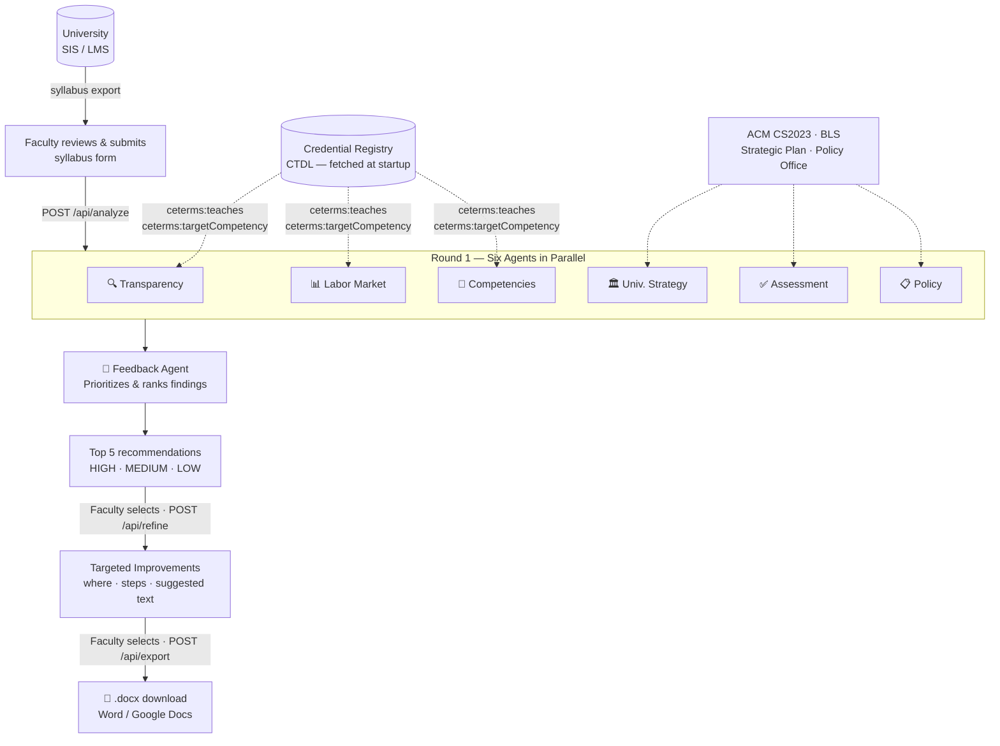

# Faculty Course Co-Design System

> AI-powered curriculum alignment for higher education faculty

Built at the **Wharton/Gates Build-A-Thon** (May 19, 2026) — a one-day sprint exploring AI-native research workflows for understanding how AI is reshaping jobs, skills, and the economy. This project applies that lens to higher education: helping faculty keep pace with a rapidly shifting labor market by surfacing real-time signals from job profiles, peer curricula, and competency registries directly inside the syllabus design process.

**GitHub:** https://github.com/chrisdavisj/faculty-course-co-design-system

---

## The Problem

Faculty updating course syllabi face a fragmented information landscape: labor market signals live in one place, peer course practices in another, institutional policy in a third, and competency frameworks in a fourth. The result is curricula that drift from workforce needs — often invisibly, over years.

This tool gives faculty a structured, multi-source feedback loop in under two minutes, without requiring them to leave their syllabus workflow.

---

## How It Works

A faculty member submits their syllabus — pulled from the university source system or entered manually. Six specialized AI agents analyze it in parallel against live external data sources. A Feedback Agent synthesizes their output into a prioritized list of improvements. The faculty member selects recommendations, gets step-by-step revision guidance, and downloads a ready-to-edit `.docx` file.



### The Six Agents

| Agent | Role | Data Source |
|-------|------|-------------|
| **Transparency** | Peer benchmarking — what comparable courses cover and where yours diverges | Credential Registry peer course records |
| **Labor Market** | Gap analysis against real job competency requirements | Credential Registry job profile (Computer Programmer 1) |
| **Competencies** | Alignment scoring across authoritative competency frameworks using CTDL `strengthOfFit` | Credential Registry course competencies (CTDL) |
| **University Strategy** | Opportunities to advance institutional goals (experiential learning, industry partnerships) | University Strategic Plan 2024–2028 |
| **Assessment** | AI-circumvention risk in current assessments; AI-resistant alternatives | ACM SIGCSE 2024 best practices |
| **Policy** | Compliance gap scoring against university policy requirements | University Academic Policy Office |

A **Feedback Agent** then prioritizes and synthesizes findings into ranked recommendations labeled HIGH / MEDIUM / LOW.

### Three-Round Interaction

1. **Analyze** — Submit syllabus → receive agent findings and top-5 prioritized recommendations
2. **Refine** — Select recommendations → receive targeted revision guidance (where to add, step-by-step, suggested text)
3. **Export** — Select improvements to include → download a `.docx` for editing in Word or Google Docs

---

## Live Data Sources

This demo fetches real data from the **Credential Transparency Description Language (CTDL)** registry at startup:

**Job profile** (Computer Programmer 1, Local Government)
- https://credentialengineregistry.org/resources/ce-0bb27534-f864-4c49-8bac-d5c0e7f0e2b4

**Peer courses** (6 algorithms/data structures courses with published competencies)
- CSC 249 — Data Structures & Algorithms (Forsyth Tech): `ce-e87d4f45...`
- C949 — Data Structures and Algorithms I (WGU): `ce-a37328b3...`
- C950 — Data Structures and Algorithms II (WGU): `ce-5cafd3aa...`
- Advanced Data Structures in C++ (UC Santa Cruz): `ce-19178d10...`
- `ce-d4a7a7f0...` and `ce-b906ca6d...`

Alignment scoring uses keyword overlap against `ceterms:teaches` (courses) and `ceterms:targetCompetency` (jobs) fields, mapping to HIGH (≥30% overlap) / MEDIUM (≥10%) / LOW (<10%). Agent cards display clickable citations linking back to the source Credential Registry resource.

**Additional sources referenced:** ACM CS2023 Curriculum Guidelines · MIT OCW 6.006 · BLS Occupational Outlook · ACM SIGCSE 2024

---

## Tech Stack

| Layer | Technology |
|-------|-----------|
| Backend | Python 3.11 · FastAPI · uvicorn |
| Data fetching | httpx (synchronous, loaded at startup via lifespan) |
| Document export | python-docx |
| Frontend | React 18 · TypeScript · Vite |
| Styling | Plain CSS (no UI framework) |
| Dev proxy | Vite → FastAPI on port 8000 |

---

## Commands

```bash
# Backend — install dependencies
cd demo/backend
pip install -r requirements.txt

# Backend — start (fetches Credential Registry data at startup, ~10 sec)
uvicorn main:app --host 127.0.0.1 --port 8000

# Frontend — install and start dev server
cd demo/frontend
npm install
npm run dev          # http://localhost:5174

# Frontend — production build
npm run build
```

API endpoints:
```
POST /api/analyze   — submit syllabus, receive agent findings + recommendations
POST /api/refine    — submit selected recommendation ranks, receive improvement plans
POST /api/export    — submit selected improvements, receive .docx download
GET  /api/health    — liveness check
```

---

## Project Structure

```
demo/
├── backend/
│   ├── main.py                  # FastAPI app, lifespan loader, all endpoints
│   ├── credential_registry.py   # CTDL fetch, tokenize, strength_of_fit, coverage_pct
│   └── requirements.txt
├── frontend/
│   ├── src/
│   │   ├── App.tsx              # State management, API calls, three-round flow
│   │   ├── types.ts             # AgentResult, Recommendation, TargetedImprovement, etc.
│   │   ├── index.css            # All styles (single file)
│   │   └── components/
│   │       ├── SyllabusForm.tsx          # Input form with demo pre-fill
│   │       ├── AgentCard.tsx             # Collapsible findings card with citations
│   │       ├── FeedbackSummary.tsx       # Recommendation list with selection checkboxes
│   │       └── TargetedImprovements.tsx  # Improvement cards with export selection
│   ├── vite.config.ts           # Proxy /api/* → port 8000
│   └── package.json
└── README.md
```

---

## Design Boundaries

Following the three-tier boundary model from the O'Reilly spec guidance:

**Always**
- Display Credential Registry source URIs as clickable citations on all data-driven findings
- Fall back gracefully to descriptive findings if any registry resource is unreachable at startup
- Treat all output as advisory — faculty judgment takes precedence over agent recommendations

**Ask first** (in a production build)
- Changing which Credential Registry CTIDs are fetched at startup
- Modifying competency scoring thresholds (HIGH / MEDIUM / LOW cutoffs)
- Adding new agent types or external data sources

**Never**
- Submit syllabus content to a third-party service in this demo (scoring is local keyword overlap)
- Store or log syllabus content server-side
- Make blocking network calls inside request handlers (all CR data is pre-loaded at startup)

---

## Known Limitations and Next Steps

**Build-a-thon scope**
- Competency alignment uses keyword overlap (`strength_of_fit`), not semantic embeddings — fast and deterministic, but coarse
- Agents for University Strategy, Assessment, and Policy use curated example findings rather than live data; the CR-backed agents (Transparency, Labor Market, Competencies) use real data
- Pilot is scoped to CS algorithms courses; peer course and job CTIDs are hardcoded

**Toward a full system**
- Replace keyword scoring with embedding-based similarity (sentence-transformers or an embeddings API)
- Wire real LLM calls into each agent for generative, syllabus-specific feedback
- Let faculty supply their institution's strategic plan and policy documents as context inputs
- Make the CTID set searchable and configurable rather than hardcoded
- Add inline edit mode: accept/reject individual agent suggestions in the UI, à la Google Docs
- Persist sessions so faculty can return to an in-progress review

---

## Build-A-Thon Context

This prototype was built in response to the Wharton/Gates Build-A-Thon challenge:

> *"How can AI help build a continuous, grounded view of its economic impact? Which signals best capture shifts in jobs, skills, and productivity — and how can they be connected into an evolving picture?"*

The Faculty Course Co-Design System treats higher education curricula as a live signal of the gap between what the workforce needs and what institutions are teaching. By connecting syllabi to real labor market competency data via the Credential Registry, it demonstrates one concrete path from fragmented signals to structured, decision-ready insight — and puts that insight directly in the hands of the people who can act on it: faculty.

**Team:** Wharton Build-A-Thon 2026 · CS Algorithms pilot · May 19, 2026
